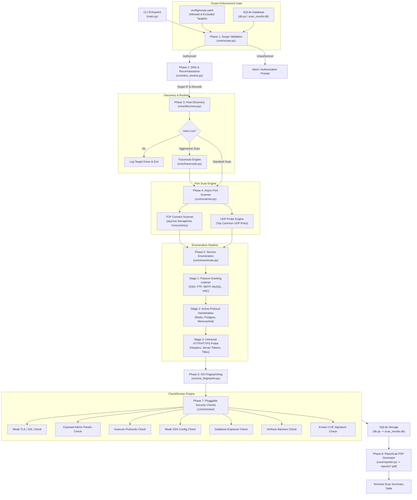

# Host & Network Hardener (`cyart`)

[](https://www.python.org/)
[](#license)
[](#tests-and-quality-checks)
[](#technology-stack)
[](#pdf-security-reports)
[](#prerequisites-and-setup)

> **A safe, non-destructive network auditing, port scanning, service enumeration, and vulnerability assessment engine built natively in Python.**

Designed with an asynchronous I/O core, pluggable security checks, pre-flight scope enforcement, embedded SQLite persistence, and executive-ready vector PDF reporting — with zero external database servers or message queues required.

---

## Table of Contents

- [Overview](#overview)
- [Key Features](#key-features)
- [Technology Stack](#technology-stack)
- [Architecture & Data Flow](#architecture--data-flow)
- [Repository Structure](#repository-structure)
- [Prerequisites and Setup](#prerequisites-and-setup)
- [Configuration](#configuration)
- [How to Run and Use](#how-to-run-and-use)
  - [Interactive Mode](#1-interactive-mode)
  - [Command-Line Scanning](#2-command-line-scanning)
  - [Aggressive Mode (`-A`)](#3-aggressive-mode--a)
  - [Port Specification & Protocol Control](#4-port-specification--protocol-control)
  - [Firewall & Filtered Port Diagnosis](#5-firewall--filtered-port-diagnosis)
  - [Scope Management](#6-scope-management)
  - [Scan History & SQLite Database](#7-scan-history--sqlite-database)
  - [PDF Security Reports](#8-pdf-security-reports)
  - [Complete CLI Flag Reference](#9-complete-cli-flag-reference)
- [Pluggable Security Checks](#pluggable-security-checks)
- [Tests and Quality Checks](#tests-and-quality-checks)
- [Operational & Deployment Notes](#operational--deployment-notes)
- [Safe Usage & Legal Disclaimer](#safe-usage--legal-disclaimer)
- [Contribution & License](#contribution--license)

---

## Overview

**Host & Network Hardener** is an all-in-one network reconnaissance and security audit framework. It eliminates the operational complexity of managing multi-tier scanning architectures or dual-language tooling (e.g., C/Go scan engines coupled with Python scripts). 

Operating entirely through Python's native asynchronous I/O event loop (`asyncio`), the engine applies bounded concurrency across all 65,535 TCP ports and high-priority UDP ports. A mandatory pre-flight scope gatekeeper ensures network interactions remain strictly confined to authorized assets. Findings are enriched through multi-stage banner acquisition, heuristic OS fingerprinting, and quantitative risk evaluation, producing both structured terminal summaries and publication-grade PDF audit reports.

---

## Key Features

- **Pre-Flight Scope Gatekeeper**: Enforces strict CIDR block, IP address, and domain allowlists against `config/scope.yaml` and SQLite before any network socket is opened.
- **High-Throughput Async Port Scanner**: Scans all 65,535 TCP ports using `asyncio.Semaphore` bounded concurrency (default: 250 workers), avoiding socket exhaustion while maximizing throughput.
- **Dual TCP & UDP Auditing**: Conducts standard TCP connect scans alongside automated probes against top UDP network services (DNS, DHCP, TFTP, SNMP, NTP, IKE/IPsec, OpenVPN, mDNS).
- **Automated DNS Reconnaissance**: Resolves forward records (A, AAAA, MX, NS, TXT), executes reverse DNS lookups (PTR), and caches responses in SQLite to prevent redundant queries.
- **Multi-Method Host Discovery**: Validates host liveness using TCP connect probes against standard ports (80, 443, 22) and ICMP Echo ping verification.
- **Three-Stage Service Enumeration**:
  1. *Passive Greeting Listener*: Reads initial server greetings from banner-emitting protocols (SSH, FTP, SMTP, MySQL, Telnet, VNC).
  2. *Active Protocol Handshakes*: Transmits targeted application queries to database and cache engines (Redis, PostgreSQL, Memcached).
  3. *Universal HTTP/HTTPS Probe*: Interrogates web servers across arbitrary ports for response headers (`Server`, `X-Powered-By`) and page titles.
- **Heuristic OS Fingerprinting**: Infers target operating systems and platforms with percentage confidence metrics by correlating banner signatures, HTTP response headers, and protocol behaviors.
- **Aggressive Audit Mode (`-A`)**: Orchestrates in-depth banner probing, heuristic OS detection, vulnerability checks, and asynchronous network hop tracing (`tracert` on Windows, `traceroute` on POSIX).
- **Pluggable Vulnerability Check Suite**: Extensible security evaluation modules covering weak TLS protocols and ciphers, exposed admin consoles, plain-text protocol exposure, legacy SSH configurations, publicly accessible database ports, and information-leaking banners.
- **Quantitative Risk Scoring**: Computes risk matrix scores (`Impact (1-5) × Likelihood (1-5)` = Risk Score out of 25) with findings categorized into Info, Low, Medium, High, and Critical tiers.
- **Executive & Technical PDF Reporting**: Generates vector-based PDF audit reports powered by ReportLab, incorporating executive summaries, open port inventories, firewall diagnostics, and technical remediation cards.
- **Embedded Local Persistence**: Retains historical host records, port states, service banners, and vulnerability findings in a zero-configuration SQLite database (`scan_results.db`).

---

## Technology Stack

| Layer | Library / Tool | Version Constraint | Purpose in Project |
|---|---|---|---|
| **Language Runtime** | Python | `>= 3.10` | Core runtime (tested and validated on Python 3.13) |
| **Concurrency Core** | `asyncio` | Built-in | Non-blocking asynchronous socket I/O & worker management |
| **Network Probing** | `socket`, `ssl` | Built-in | TCP connect handshakes, banner extraction, TLS socket wrapping |
| **DNS Resolution** | `dnspython` | `>= 2.6.0` | Comprehensive DNS record interrogation (A, AAAA, MX, NS, TXT) |
| **HTTP Inspection** | `requests` | `>= 2.31.0` | HTTP banner inspection and admin interface discovery |
| **Cryptographic Auditing** | `cryptography` | `>= 42.0.0` | Certificate extraction, expiration checks, and cipher assessment |
| **CLI Framework** | `click` | `>= 8.1.7` | Command-line parsing, terminal formatting, and user prompts |
| **Configuration** | `pyyaml` | `>= 6.0.1` | YAML serialization and deserialization for scope rules |
| **Data Storage** | `sqlite3` | Built-in | Relational persistence for scan histories, hosts, and findings |
| **Document Generation** | `reportlab` | `>= 4.0.0` | Vector-rendered executive and technical PDF reports |
| **Testing Engine** | `pytest`, `pytest-asyncio` | `>= 8.0.0`, `>= 0.23.0` | Asynchronous test execution and test discovery |

---

## Architecture & Data Flow

The scanning pipeline is orchestrated by `main.py` through sequential, decoupled phases. Target data flows through the validator, reconnaissance engines, port scanner, service enumerator, check runner, persistence layer, and PDF generator.



---

## Repository Structure

```
cyart-pro/
├── config/
│   └── scope.yaml              # Authorized targets, exclusions, rate limits, and scan windows
├── core/
│   ├── __init__.py             # Core package initialization
│   ├── checks/                 # Pluggable security check modules
│   │   ├── __init__.py         # BaseCheck abstract class & CheckRunner execution registry
│   │   ├── database_exposure.py# Direct database exposure checks (MySQL, Postgres, Redis, etc.)
│   │   ├── exposed_admin_panels.py # Administrative web console probe logic
│   │   ├── insecure_protocols.py   # Plain-text protocol detection (Telnet, FTP, HTTP)
│   │   ├── known_cve.py        # Known vulnerability signature matching
│   │   ├── verbose_banners.py  # Information-leaking banner disclosure checks
│   │   ├── weak_ssh.py         # SSH-1 and deprecated protocol version audits
│   │   └── weak_tls.py         # SSLv2/v3, TLS 1.0/1.1, and deprecated cipher audits
│   ├── discovery.py            # ICMP Echo and TCP connect host liveness verification
│   ├── dns_resolve.py          # Forward (A/AAAA/MX/NS/TXT) and reverse (PTR) DNS resolution
│   ├── enumerate.py            # Three-stage protocol banner grabbing and service identification
│   ├── models.py               # Strongly typed data models (PortInfo, Finding, Severity, ScopeConfig)
│   ├── os_fingerprint.py       # Heuristic operating system detection and confidence scoring
│   ├── reporter.py             # Professional ReportLab PDF generation engine
│   ├── scanner.py              # Async TCP and UDP port scanning engine
│   ├── scope.py                # Pre-scan scope gatekeeper and configuration synchronization
│   └── traceroute.py           # Cross-platform asynchronous traceroute runner
├── reports/                    # Destination directory for generated PDF audit reports
├── tests/                      # Automated test suite (54 test cases)
│   ├── test_checks.py          # Unit tests for security checks
│   ├── test_db.py              # Unit tests for SQLite database schema and operations
│   ├── test_dns_discovery.py   # Unit tests for DNS resolution and host discovery
│   ├── test_enumerate.py       # Unit tests for banner grabbing and service enumeration
│   ├── test_os_fingerprint.py  # Unit tests for heuristic OS fingerprinting
│   ├── test_reporter.py        # Unit tests for PDF report compilation
│   ├── test_scanner.py         # Unit tests for port parsing and async port scanning
│   └── test_scope.py           # Unit tests for scope validation and target sanitization
├── db.py                       # SQLite database manager, schema migrations, and DAO methods
├── main.py                     # Primary CLI entrypoint and pipeline controller
├── pyrefly.toml                # Project environment and site-package path definition
├── pytest.ini                  # Pytest configuration (asyncio mode and discovery paths)
├── requirements.txt            # Production and development dependencies
└── README.md                   # Technical system documentation
```

---

## Prerequisites and Setup

### System Prerequisites
- **Python**: Version `3.10` or higher (verified on Python 3.13)
- **Operating System**: Windows, Linux, or macOS
- **System Rights**: Standard user privileges (raw sockets are not required; scans operate via unprivileged TCP connect handshakes)

### 1. Clone the Repository
```bash
git clone https://github.com/your-username/cyart-pro.git
cd cyart-pro
```

### 2. Configure a Virtual Environment

**On Windows (PowerShell):**
```powershell
python -m venv .venv
.\.venv\Scripts\Activate.ps1
```

**On Windows (Command Prompt):**
```cmd
python -m venv .venv
.\.venv\Scripts\activate.bat
```

**On Linux / macOS:**
```bash
python3 -m venv .venv
source .venv/bin/activate
```

### 3. Install Dependencies
```bash
pip install --upgrade pip
pip install -r requirements.txt
```

---

## Configuration

### 1. Scope Rules (`config/scope.yaml`)
Target boundaries are governed by `config/scope.yaml`. Targets not explicitly covered by `allowed_targets` or belonging to `excluded_targets` are blocked prior to network transmission.

```yaml
# Authorized targets: specific IP addresses, CIDR network blocks, or domain names
allowed_targets:
  - 127.0.0.1
  - localhost
  - ::1
  - 127.0.0.0/8
  - scanme.nmap.org
  - 192.168.1.0/24

# Blacklisted targets: explicitly blocked even if inside an allowed CIDR block
excluded_targets:
  - 127.0.0.99

# Maximum outgoing socket connections allowed per second
max_rate_per_sec: 50

# Scan execution time window in UTC (HH:MM-HH:MM)
scan_window: "00:00-23:59"
```

### 2. Database Storage (`scan_results.db`)
Database initialization is completely automatic. On initial execution, `db.py` creates `scan_results.db` in the repository root containing three indexed tables:
- `hosts`: Stores host IDs, target strings, primary IPs, status, OS guesses, confidence, and timestamps.
- `ports`: Stores host associations, port numbers, protocols (`tcp`/`udp`), states (`open`/`closed`/`filtered`), services, banners, and evidence.
- `findings`: Stores host associations, ports, check names, vulnerability titles, severity levels, impact, likelihood, risk scores, remediation guidance, and raw evidence.

*Note: No environment variables or external API tokens are required. The system is entirely self-hosted and self-contained.*

---

## How to Run and Use

### 1. Interactive Mode
Run `main.py` without arguments to initiate the guided prompt workflow:
```bash
python main.py
```
```text
==================================================
    Host & Network Hardener
==================================================
[?] Enter target IP, domain, or subnet to scan: 127.0.0.1
[*] Phase 1: Validating target '127.0.0.1' against scope...
[+] Scope validation passed! Target '127.0.0.1' is authorized.
[*] Phase 2: DNS & Reconnaissance for target '127.0.0.1'...
...
```

---

### 2. Command-Line Scanning
Target hosts can be provided via the `-t` / `--target` option or as a positional argument:

```bash
# Scan a single host (scans all 65,535 TCP ports + top UDP ports by default)
python main.py -t 127.0.0.1

# Positional target syntax
python main.py scanme.nmap.org
```

---

### 3. Aggressive Mode (`-A`)
Enables Nmap-style aggressive auditing: heuristic OS detection, in-depth service version probing, pluggable vulnerability checks, and asynchronous network traceroute hop tracing.

```bash
python main.py -t scanme.nmap.org -A
```

---

### 4. Port Specification & Protocol Control
Customize port ranges and protocol behavior using standard port formatting:

```bash
# Scan standard web and database ports
python main.py -t 127.0.0.1 -p 80,443,3306,5432,8080

# Scan the privileged port range (1-1024)
python main.py -t 192.168.1.1 -p 1-1024

# Perform a quick TCP-only scan without UDP probes
python main.py -t 127.0.0.1 -p 80,443 --no-udp

# Scan a single port with custom worker concurrency
python main.py -t 127.0.0.1 -p 22 --concurrency 50
```

---

### 5. Firewall & Filtered Port Diagnosis
By default, the terminal results table focuses on verified open ports to eliminate terminal clutter. To inspect non-responding ports and review diagnostic probe evidence (e.g., probe timeout or firewall drop):

```bash
python main.py -t scanme.nmap.org -p 21,22,80,445,3389 --show-filtered
```

---

### 6. Scope Management
Manage authorized scan boundaries directly from the CLI without editing YAML by hand:

```bash
# Display currently authorized and excluded targets
python main.py -l

# Add an IP, domain, or subnet to the authorized scope (updates scope.yaml and SQLite)
python main.py -a 192.168.1.0/24
python main.py -a audit.localdomain

# Remove a target from the authorized scope
python main.py -r audit.localdomain

# Perform pre-flight scope validation without initiating a scan
python main.py -t 10.0.0.1 --check-scope-only
```

---

### 7. Scan History & SQLite Database
Scan results persist across runs in `scan_results.db`. The CLI provides administrative commands to query and purge scan history:

```bash
# List all historically scanned hosts, port counts, and finding metrics
python main.py -s

# Delete a specific target's history from the database
python main.py --delete-scan 127.0.0.1

# Purge all stored scan records, ports, and findings from the database
python main.py --clear-db
```

---

### 8. PDF Security Reports
By default, a professional PDF security report is generated in `reports/` at the end of each scan:

```bash
# Scan and write the PDF report to a custom path
python main.py -t 127.0.0.1 -o reports/localhost_audit.pdf

# Execute a scan without generating a PDF report
python main.py -t 127.0.0.1 --no-pdf

# Export a fresh PDF report for a previously scanned host in the database
python main.py --export-pdf scanme.nmap.org -o reports/nmap_export.pdf
```

---

### 9. Complete CLI Flag Reference

| Option | Flag | Type | Default | Description |
|---|---|---|---|---|
| `--target` | `-t` | String | `None` (Prompts) | Target IP address, domain, or subnet to scan |
| `--aggressive` | `-A` | Flag | `False` | Enables OS detection, deep banner enumeration, security checks, and traceroute |
| `--ports` | `-p` | String | `None` (All 65,535) | Comma-separated list or range of ports to scan (e.g. `80,443`, `1-1024`) |
| `--full` / `--no-full` | `-F` | Bool | `True` | Scan all 65,535 TCP ports |
| `--udp` / `--no-udp` | `-u` | Bool | `True` | Probe top critical UDP services alongside TCP |
| `--concurrency` | | Integer | `250` | Maximum concurrent async socket connection workers |
| `--show-filtered` | | Flag | `False` | Print firewall diagnosis table for non-responding / filtered ports |
| `--config` | `-c` | Path | `config/scope.yaml` | Path to scope configuration YAML file |
| `--check-scope-only` | | Flag | `False` | Execute Phase 1 scope validation check and exit |
| `--add-target` | `-a` | String | `None` | Add an IP, CIDR block, or domain to authorized scope |
| `--remove-target` | `-r` | String | `None` | Remove a target from authorized scope |
| `--list-scope` | `-l` | Flag | `False` | Display all authorized and excluded scope targets |
| `--list-scans` | `-s` | Flag | `False` | List all historical scan records from SQLite database |
| `--delete-scan` | | String | `None` | Delete scan records and findings for a specific target |
| `--clear-db` | | Flag | `False` | Purge all scan data from the database with confirmation prompt |
| `--pdf` | `-o` | Path | `reports/*.pdf` | Custom output path for generated PDF report |
| `--no-pdf` | | Flag | `False` | Disable automatic PDF security report generation |
| `--export-pdf` | | String | `None` | Generate a PDF report for a previously scanned host in SQLite |
| `--help` | | Flag | | Display CLI options and usage documentation |

---

## Pluggable Security Checks

The security check architecture is defined in `core/checks/`. Each audit module subclasses `BaseCheck` and implements an isolated `run(host: str, port_info: PortInfo) -> List[Finding]` method.

```
core/checks/
├── __init__.py               # BaseCheck interface & CheckRunner registry
├── database_exposure.py      # Exposed database services (MySQL, Postgres, Redis, Mongo, Memcached)
├── exposed_admin_panels.py   # Web management and administrative console discovery
├── insecure_protocols.py     # Unencrypted plain-text protocols (Telnet, FTP, HTTP)
├── known_cve.py              # Known vulnerability signature and version matching
├── verbose_banners.py        # Information disclosure via detailed version banners
├── weak_ssh.py               # Deprecated SSH-1 and unhardened SSH configurations
└── weak_tls.py               # Deprecated SSL/TLS versions (SSLv2/v3, TLS 1.0/1.1) and weak ciphers
```

### Risk Calculation Matrix
Each discovered finding assigns integer values between `1` and `5` to **Impact** and **Likelihood**:
$$\text{Risk Score} = \text{Impact} \times \text{Likelihood} \quad (1 \le \text{Score} \le 25)$$

- **Critical**: Risk Score $\ge 20$ (e.g., unauthenticated database exposed to internet)
- **High**: Risk Score $15 - 19$ (e.g., deprecated TLS with vulnerable ciphers)
- **Medium**: Risk Score $8 - 14$ (e.g., exposed administrative interface)
- **Low**: Risk Score $4 - 7$ (e.g., plain-text protocol on private subnet)
- **Info**: Risk Score $< 4$ (e.g., verbose server version banner)

---

## Tests and Quality Checks

The repository includes a comprehensive automated test suite configured via `pytest.ini`. Tests cover asynchronous port scanning, scope enforcement, DNS resolution, banner extraction, OS heuristics, database operations, and PDF generation.

### Run All Tests
Ensure your virtual environment is active, then execute:

```bash
pytest
```

### Verbose Test Execution
```bash
pytest -v
```

### Targeted Module Testing
```bash
# Validate async scanner mechanics and port parsing
pytest tests/test_scanner.py -v

# Validate scope gatekeeper and target sanitization
pytest tests/test_scope.py -v

# Validate banner extraction and service identification
pytest tests/test_enumerate.py -v

# Validate ReportLab PDF rendering pipeline
pytest tests/test_reporter.py -v

# Validate SQLite database models and queries
pytest tests/test_db.py -v
```

**Test Suite Health**: All 54 test cases currently pass with zero regressions.

---

## Operational & Deployment Notes

- **Unprivileged Execution**: Standard TCP connect scanning operates using non-privileged operating system sockets. Root or Administrator privileges are not required.
- **Firewall Rate Limits**: The `max_rate_per_sec` parameter in `config/scope.yaml` and `--concurrency` CLI option allow tuning scan intensity to prevent triggering stateful firewall rate limits or SYN flood defenses.
- **Repository Cleanliness (`.gitignore`)**:
  - The local database `scan_results.db` and compiled reports in `reports/*.pdf` are untracked by default to prevent leaking private audit data.
  - Large sample capture files (`test1.txt`, `testt.txt`) are excluded from Git to prevent repository bloat and comply with GitHub file size restrictions.

---

## Safe Usage & Legal Disclaimer

> [!IMPORTANT]
> **Host & Network Hardener** is built strictly for authorized system hardening, defense verification, and security research.

- **Explicit Authorization**: Only scan systems, domains, and networks that you own or have explicit, documented permission to test.
- **Legal Compliance**: Port scanning or security probing against unauthorized networks may violate local, state, national, and international laws (such as the U.S. Computer Fraud and Abuse Act - CFAA).
- **Safe Testing Environments**: When testing or developing new checks, use local loopback (`127.0.0.1`), dedicated local Docker containers, or authorized public testing services like `scanme.nmap.org`.

The authors and contributors accept no responsibility or liability for damages or legal consequences arising from the use or misuse of this software.

---

## Contribution & License

### Contributing New Checks
1. Create a new check module in `core/checks/your_check_name.py`.
2. Inherit from `BaseCheck` (`core/checks/__init__.py`) and implement `name`, `description`, and `run()`.
3. Register your check inside `_load_default_checks()` in `core/checks/__init__.py`.
4. Add corresponding unit tests in `tests/test_checks.py`.
5. Run `pytest` to verify all tests pass.

### License
This project is licensed under the [MIT License](LICENSE).
Permission is hereby granted, free of charge, to any person obtaining a copy of this software and associated documentation files to use, copy, modify, and distribute the software for security hardening and educational purposes.
